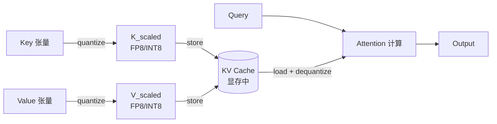
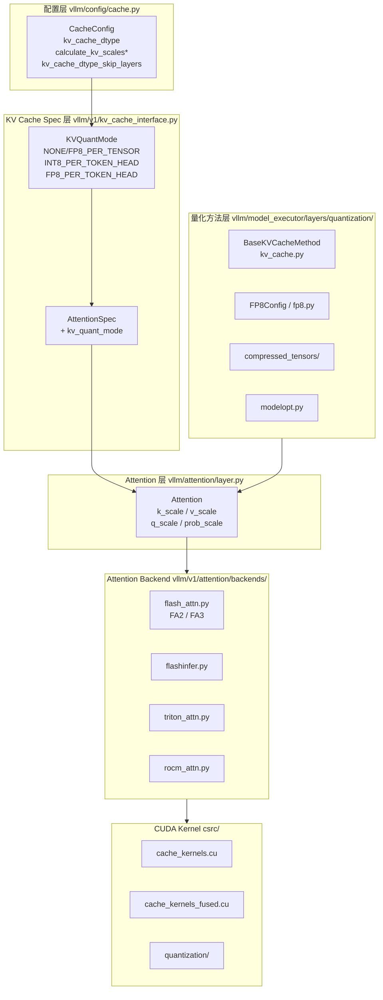
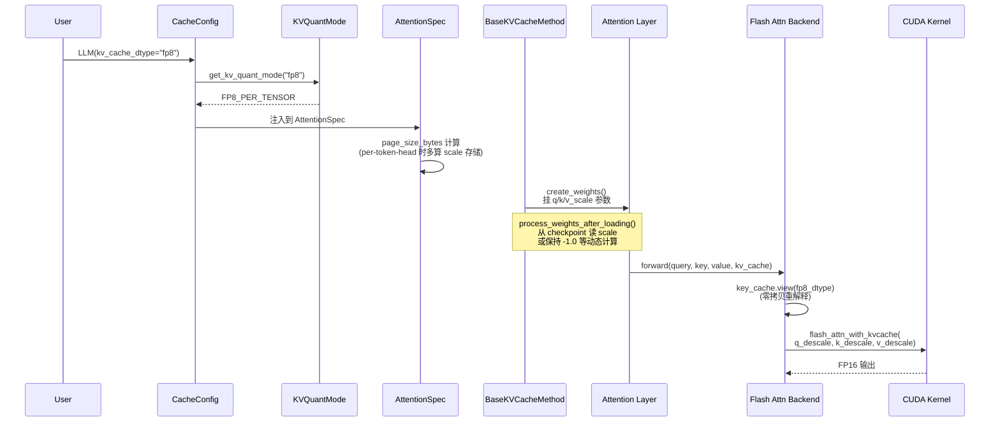
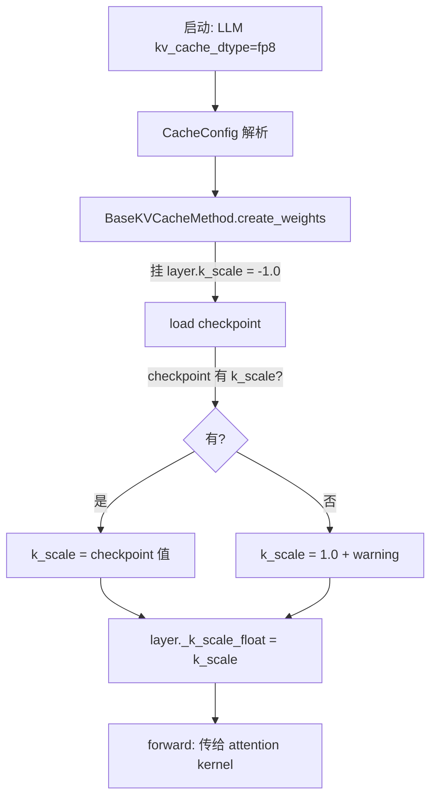

# vLLM KV Cache Quantization 特性代码走读技术文档

> **文档版本**: 1.0
> **分析代码版本**: vLLM main 分支（截至 2026-04）
> **最后更新**: 2026-04-30
> **生成方式**: 套用 `vllm-feature-tutorial` Skill 方法论生成

---

## 文档概述

本文档对 vLLM 中 **KV Cache Quantization** 特性进行端到端代码走读，覆盖从配置入口到 CUDA kernel 的全栈实现。

**适合读者：**

- 想理解 vLLM 内存优化机制的工程师
- 计划贡献 KV cache 相关特性（特别是 INT8 / 新量化模式）的开发者
- 在做长上下文 / 大 batch 推理调优的部署工程师

**阅读指南：**

- **第一部分**先建立心智模型（为什么需要 KV cache 量化、它在 vLLM 中的位置）
- **第二部分**梳理核心类型与接口（`KVQuantMode`、`BaseKVCacheMethod`、`AttentionSpec`）
- **第三部分**深入实现（配置流程、三条 scale 计算路径、attention backend 集成）
- **第四部分**横向对比三种量化模式与不同后端
- **第五部分**实操配置和调优建议
- **附录**包含完整的代码位置索引

---

# 第一部分: KV Cache Quantization 基础与架构总览

## 1.1 KV Cache Quantization 原理

### 1.1.1 基本思想：为什么 KV Cache 是首要优化目标

LLM 推理的内存占用由三部分组成：模型权重、激活值、**KV cache**。在长上下文 / 大 batch 场景下，KV cache 几乎一定会变成主导项。

单个 token 的 KV cache 大小：

$$\text{Mem}_{\text{kv}}(\text{per token}) = 2 \cdot L \cdot H \cdot d \cdot \text{sizeof}(\text{dtype})$$

其中：

- $2$：K 和 V 两个张量
- $L$：layer 数
- $H$：KV head 数（GQA 下小于 query head 数）
- $d$：head dimension
- $\text{sizeof}(\text{dtype})$：FP16 = 2B，FP8/INT8 = 1B

以 Llama-3-70B（80 层，8 个 KV head，128 head dim）为例，每个 token 在 FP16 下需要 **320KB** KV cache；64K 上下文就是 **20GB**。把 dtype 从 FP16 降到 FP8/INT8，内存直接砍半。

> **关键洞察**：量化 KV cache 不是为了让模型变快——存储和加载快了，但 attention 计算大多还是要在更高精度下完成。**它的真正收益是节省显存**，从而在同样的 GPU 上塞更大的 batch / 更长的上下文。这种"间接增吞吐"才是 KV 量化的核心价值。

### 1.1.2 工作流程

KV cache 量化在数据流上插在 attention 计算的两端：



写入路径 `quantize`：
$$x_{\text{quant}} = \text{round}\left(\frac{x_{\text{fp16}}}{\text{scale}}\right)$$

读取路径 `dequantize`：
$$x_{\text{fp16}} \approx x_{\text{quant}} \cdot \text{scale}$$

### 1.1.3 性能与精度权衡

| 维度 | FP16 → FP8 | FP16 → INT8 |
| --- | --- | --- |
| 内存节省 | 50% | 50% |
| 数值表示 | 浮点（动态范围大） | 定点（均匀分布） |
| 主要误差源 | 尾数截断 | 量化噪声 |
| 硬件加速 | H100 native FP8 Tensor Core | 普及度高，A100 也支持 |
| 典型精度损失 | 接近无损（E4M3） | 轻微（per-tensor）/ 接近无损（per-token-head）|

### 1.1.4 关键概念定义

| 术语 | 定义 |
| --- | --- |
| **scale** | 量化因子，把浮点数映射到量化空间的乘子 |
| **zero point** | 偏移量（INT8 对称量化时为 0，可忽略）|
| **per-tensor** | 整个 tensor 共享一个 scale，最便宜但最易丢精度 |
| **per-token** | 每个 token 一个 scale，沿序列维度 |
| **per-head** | 每个 attention head 一个 scale |
| **per-token-head** | 同时按 token × head 分组，最细粒度也最准 |
| **E4M3 / E5M2** | FP8 的两种格式：4 位指数 3 位尾数 / 5 位指数 2 位尾数 |
| **FNUZ** | AMD ROCm 的 FP8 变体（Finite, No Unsigned Zero）—— scale 需 ×2 |

> **关键洞察**：vLLM 把"量化粒度"做成了一个独立维度，而不是绑死在 dtype 上。同一个 INT8 cache，可以用 per-tensor 也可以用 per-token-head；这种正交设计让后续扩展（比如未来的 INT4 cache）成本更低。

## 1.2 vLLM KV Cache Quantization 整体架构

### 1.2.1 系统架构总览



> 标注 `*` 的字段为已废弃（v0.19 将移除）。

### 1.2.2 核心组件与职责

| 组件 | 文件 | 职责 |
| --- | --- | --- |
| **配置** | `vllm/config/cache.py` | 解析 `kv_cache_dtype` 字符串，校验 dtype 与硬件兼容性 |
| **模式枚举** | `vllm/v1/kv_cache_interface.py` | `KVQuantMode` 把字符串映射为内核可分发的整数 |
| **Spec** | `vllm/v1/kv_cache_interface.py` | `AttentionSpec.kv_quant_mode`，参与 page size 计算 |
| **量化方法** | `vllm/model_executor/layers/quantization/kv_cache.py` | `BaseKVCacheMethod` 在 attention layer 上挂 scale 参数 |
| **Attention 层** | `vllm/attention/layer.py` | 持有 `_k_scale_float / _v_scale_float / _q_scale_float` |
| **Backend** | `vllm/v1/attention/backends/flash_attn.py` | forward() 时把量化 cache view 成 FP8，传 scale 给 kernel |
| **CUDA Kernel** | `csrc/cache_kernels.cu`, `cache_kernels_fused.cu` | 实际写入 cache 时做量化 |

### 1.2.3 数据流：从字符串到 GPU kernel



## 1.3 执行流程详解

vLLM 提供**三条独立的 scale 计算路径**，用户根据精度要求和准备成本选择：

### 路径 A：静态 / 默认（无 calibration）

```
用户:    LLM(kv_cache_dtype="fp8")
配置:    calculate_kv_scales=False (默认)
checkpoint:  没有 k_scale/v_scale
结果:    所有 scale = 1.0
精度:    最差，但零成本
```

### 路径 B：动态 warm-up（已废弃）

```
用户:    LLM(kv_cache_dtype="fp8", calculate_kv_scales=True)
机制:    第一个 batch warm-up 估算一次 scale 后固定
状态:    DEPRECATED (v0.19 移除)
```

### 路径 C：离线 calibration（推荐）

```
用户:    用 llm-compressor 离线生成带 scale 的 checkpoint
checkpoint:  含 k_scale, v_scale
精度:    最好；支持 per-attention-head
```

### 路径 D：Per-token-head 动态（最新）

```
用户:    LLM(kv_cache_dtype="int8_per_token_head") 或 "fp8_per_token_head"
机制:    kernel 在写入 cache 时按 (token, head) 分组动态计算 scale
存储:    每个 (token, head) 多存一个 FP32 scale
精度:    接近无损；CUDA kernel 直接吐出 scale
```

> **关键洞察**：路径 D 是社区推动的新方向。它把 calibration 完全消除（既不需要离线也不需要 warm-up），代价是 kernel 复杂度和每个 token 多 4 字节 scale 存储。如果你做 INT8 KV cache，**优先走 D**。

---

# 第二部分: 核心接口与基类分析

## 2.1 `KVQuantMode` —— 量化模式的统一枚举

文件：`vllm/v1/kv_cache_interface.py:30-66`

```python
class KVQuantMode(IntEnum):
    """KV cache quantization mode.

    Used by attention backends and kernels to dispatch quantization logic
    without string matching on ``kv_cache_dtype``.
    """

    NONE = 0
    FP8_PER_TENSOR = 1        # per-tensor scales (current fp8 path)
    INT8_PER_TOKEN_HEAD = 2   # per-token-head dynamic scales for int8
    FP8_PER_TOKEN_HEAD = 3    # per-token-head dynamic scales for fp8

    @property
    def is_per_token_head(self) -> bool:
        """True for any per-token-head quantization mode."""
        return self >= 2


def get_kv_quant_mode(kv_cache_dtype: str) -> KVQuantMode:
    """Map a ``kv_cache_dtype`` string to a :class:`KVQuantMode`."""
    if kv_cache_dtype == "int8_per_token_head":
        return KVQuantMode.INT8_PER_TOKEN_HEAD
    if kv_cache_dtype == "fp8_per_token_head":
        return KVQuantMode.FP8_PER_TOKEN_HEAD
    if kv_cache_dtype.startswith("fp8"):
        return KVQuantMode.FP8_PER_TENSOR
    return KVQuantMode.NONE


def is_quantized_kv_cache(kv_cache_dtype: str) -> bool:
    return get_kv_quant_mode(kv_cache_dtype) != KVQuantMode.NONE
```

> **要点**：
>
> - 这个 enum 是**字符串与 kernel dispatch 的解耦层**——避免把字符串 `"fp8_e4m3"` 直接传到 kernel 里 if-else。
> - `is_per_token_head` 用 `self >= 2` 利用 IntEnum 数值排序——熟悉 SCHEDULER.md 里 `RequestStatus.is_finished` 的同款技巧。
> - 注意 `"fp8"` / `"fp8_e4m3"` / `"fp8_e5m2"` 全部映射到 **`FP8_PER_TENSOR`**，因为它们的语义在 vLLM 里都是 per-tensor。

## 2.2 `AttentionSpec` —— KV cache 形状描述符

文件：`vllm/v1/kv_cache_interface.py:113-145`

```python
@dataclass(frozen=True, kw_only=True)
class AttentionSpec(KVCacheSpec):
    num_kv_heads: int
    head_size: int
    dtype: torch.dtype
    kv_quant_mode: KVQuantMode = KVQuantMode.NONE
    page_size_padded: int | None = None

    @property
    def page_size_bytes(self) -> int:
        real_page_size = self.real_page_size_bytes
        # Per-token-head scales are stored in separate tensors managed
        # by the attention backend, but the memory is carved from the
        # raw KV cache allocation so it must be budgeted here.
        if self.kv_quant_mode.is_per_token_head:
            real_page_size += (
                2 * self.block_size * self.num_kv_heads * get_dtype_size(torch.float32)
            )
        if self.page_size_padded is not None:
            assert self.page_size_padded >= real_page_size
            return self.page_size_padded
        return real_page_size

    @property
    def real_page_size_bytes(self) -> int:
        return (
            2 * self.block_size * self.num_kv_heads * self.head_size
            * get_dtype_size(self.dtype)
        )
```

> **要点**：
>
> - `kv_quant_mode` 是 spec 的一等字段，参与 **page size 计算**——这意味着 KV cache manager 在分配 block 时就已经知道你要不要量化、要不要额外存 scale。
> - per-token-head 模式额外多分配 `2 * block_size * num_kv_heads * 4B`：每个 (token, head) 一个 FP32 scale，K 和 V 各一份。
> - 例如 block_size=16, num_kv_heads=8，per-token-head 每个 page 多 1KB scale 存储。

## 2.3 `BaseKVCacheMethod` —— 量化方法的核心基类

文件：`vllm/model_executor/layers/quantization/kv_cache.py:18-173`

这个类是所有 KV cache 量化算法的"父类"。它的核心职责是**在 attention layer 上挂 scale 参数**：

```python
class BaseKVCacheMethod(QuantizeMethodBase):
    """
    Quant method that adds `_k_scale` and `_v_scale` attributes to the
    Attention layer to support loading those scaling factors from checkpoints.
    The k/v_scale will be used to:
        - quantize k/v_cache entries before saving them to the cache
        - dequantize k/v_cache entries before fetching them from the cache
    """

    def __init__(self, quant_config: QuantizationConfig):
        self.quant_config = quant_config

    def create_weights(self, layer: torch.nn.Module):
        """
        Create "weight" (aka q_scale, k_scale and v_scale)
        for an attention layer.
        """
        # Initialize the Q and KV cache scales to -1.0, an invalid value.
        # If the q and k/v_scales appear in the checkpoint, it will be
        # overwritten when loading weights.
        layer.q_scale = torch.nn.Parameter(torch.tensor(-1.0), requires_grad=False)
        layer.k_scale = torch.nn.Parameter(torch.tensor(-1.0), requires_grad=False)
        layer.v_scale = torch.nn.Parameter(torch.tensor(-1.0), requires_grad=False)
        # Initialize P = softmax(QK^T) scales
        layer.prob_scale = torch.nn.Parameter(torch.tensor(-1.0), requires_grad=False)
```

**几个值得注意的设计细节**：

1. **初始值 `-1.0` 作为"未设置"哨兵**：负数 scale 是物理无意义的，所以可以无歧义地表示"checkpoint 里没有提供"。
2. **`q_scale` 和 `prob_scale` 也存在**：这是为了支持 FP8 attention（不只 KV，连 Q 和中间的 softmax 概率都做量化）。
3. **`requires_grad=False`**：纯推理用，不参与训练梯度。

### 2.3.1 `process_weights_after_loading` —— 三种分支

这个方法在加载 checkpoint 之后被调用，根据情况分发到三条路径。**这是整个 quant method 的核心控制流**：

```python
def process_weights_after_loading(self, layer: torch.nn.Module) -> None:
    if not hasattr(layer, "q_scale"):
        # 没量化层，直接跳过
        return

    # ============ 分支 1: per-token-head（最新路径）============
    if kv_cache_uses_per_token_head_scales(layer.kv_cache_dtype):
        layer._k_scale.copy_(1.0)
        layer._v_scale.copy_(1.0)
        layer._k_scale_float = 1.0
        layer._v_scale_float = 1.0
        del layer.k_scale
        del layer.v_scale
        del layer.q_scale
        del layer.prob_scale
        return  # scale 由 kernel 动态算，无需后续处理

    # ============ 分支 2: per-tensor 量化（FP8）============
    if (
        is_quantized_kv_cache(layer.kv_cache_dtype)
        and not layer.calculate_kv_scales
    ):
        if layer.k_scale > 0.0 and layer.v_scale > 0.0:
            # checkpoint 提供了 scale -> 直接用
            k_scale = layer.k_scale.to("cpu").tolist()
            v_scale = layer.v_scale.to("cpu").tolist()
            if current_platform.is_fp8_fnuz():
                k_scale *= 2  # AMD ROCm FP8 FNUZ 校正
                v_scale *= 2
        elif layer.k_scale < 0.0 and layer.v_scale < 0.0:
            # 都是 -1，没有 scale -> 默认 1.0
            k_scale = 1.0
            v_scale = 1.0
        else:
            # 只有 k_scale 没有 v_scale 的旧 checkpoint 兼容
            ...

        layer._k_scale.copy_(k_scale)
        layer._v_scale.copy_(v_scale)
        layer._k_scale_float = k_scale
        layer._v_scale_float = v_scale
```

**为什么需要 `_k_scale_float` 这个"看起来重复的字段"？**

> **关键洞察**：`_k_scale` 是 `torch.Tensor`，而 `_k_scale_float` 是 Python `float`。在 forward path 里，每次访问 Tensor 元素都要 GPU→CPU 同步（`.item()` 或 `.tolist()` 都阻塞），这在 hot path 上代价昂贵。预先 cache 一份 float 版本可以避免每次 forward 时同步。这是 vLLM 性能优化的典型手法之一。

### 2.3.2 FNUZ scale 校正

```python
if current_platform.is_fp8_fnuz():
    k_scale *= 2
```

这是 AMD ROCm 的 FP8 变体（Finite, No Unsigned Zero）兼容代码。FNUZ 比 IEEE FP8 少一个表示位，等效动态范围差一倍——所以 scale 要 ×2。CUDA 上不会触发这条分支。

## 2.4 Attention layer 上的 scale 字段

文件：`vllm/attention/layer.py`

经过 `BaseKVCacheMethod.create_weights` 处理后，attention layer 上会出现这些字段：

| 字段 | 类型 | 用途 |
| --- | --- | --- |
| `layer.k_scale` | `nn.Parameter` | 从 checkpoint 加载的原始 scale（处理后被 `del`） |
| `layer.v_scale` | `nn.Parameter` | 同上 |
| `layer.q_scale` | `nn.Parameter` | FP8 attention 的 query scale |
| `layer.prob_scale` | `nn.Parameter` | FP8 attention 的 softmax 概率 scale |
| `layer._k_scale` | `Tensor`（buffer） | 运行时使用，传给 kernel |
| `layer._v_scale` | `Tensor`（buffer） | 同上 |
| `layer._k_scale_float` | `float` | 高频访问的纯 Python 副本 |
| `layer._v_scale_float` | `float` | 同上 |
| `layer.kv_cache_dtype` | `str` | 量化模式字符串，决定 `is_quantized_kv_cache` 等逻辑 |
| `layer.calculate_kv_scales` | `bool` | 已废弃；标记是否动态计算 |

---

# 第三部分: 核心实现深度分析

## 3.1 配置入口：`CacheConfig`

文件：`vllm/config/cache.py:75-100`

```python
@dataclass
class CacheConfig:
    ...
    kv_cache_dtype: CacheDType = "auto"
    """KV cache data type. Options: auto, fp8, fp8_e4m3, fp8_e5m2,
    int8_per_token_head, fp8_per_token_head."""

    calculate_kv_scales: bool = False
    """Deprecated: This option is deprecated and will be removed in v0.19.
    It enables dynamic calculation of `k_scale` and `v_scale` when
    kv_cache_dtype is fp8."""

    kv_cache_dtype_skip_layers: list[str] = field(default_factory=list)
    """Layer patterns to skip KV cache quantization. Accepts layer indices
    (e.g., '0', '2', '4') or attention type names (e.g., 'sliding_window')."""
```

**注意三个字段的状态**：

| 字段 | 状态 | 用法 |
| --- | --- | --- |
| `kv_cache_dtype` | 主入口 | 设置为 `fp8` / `int8_per_token_head` 等 |
| `calculate_kv_scales` | **DEPRECATED** | v0.19 移除；不要在新代码里依赖 |
| `kv_cache_dtype_skip_layers` | 新功能 | 跳过特定层（如 sliding window 层）的量化 |

**`calculate_kv_scales` 的废弃流程**：

```python
@field_validator("calculate_kv_scales", mode="after")
def _warn_deprecated_calculate_kv_scales(cls, calculate_kv_scales: bool) -> bool:
    if calculate_kv_scales:
        # 触发废弃警告
        ...
    return calculate_kv_scales
```

> **关键洞察**：从 `kv_cache_dtype_skip_layers` 这个新字段可以读出社区的设计观点——**KV 量化不应该是全局开关，而应该可以按层选择**。比如 sliding window 层因为窗口短，KV cache 占比小，量化收益不大但精度损失不可忽视。这种"细粒度量化"是接下来一年的明显趋势。

## 3.2 三条 Scale 计算路径详解

### 3.2.1 路径 A：静态加载（per-tensor）



代码位置：`kv_cache.py:75-127`

### 3.2.2 路径 B：动态 warm-up（已废弃）

```python
# 已废弃路径
if calculate_kv_scales:
    # 第一个 batch 时，model_runner 调用 kernel 估算 scale
    # 之后 layer.calculate_kv_scales = False，scale 被冻结
```

**为什么废弃**？

1. 第一个 batch 的数据分布不一定代表生产分布
2. 实测精度收益有限，不如离线 calibration
3. 引入了"runtime 状态变化"，对 CUDA graph 不友好

### 3.2.3 路径 D：Per-token-head 动态（推荐方向）

代码位置：`kv_cache.py:60-69`

```python
# Per-token-head quantized KV cache: scales are computed dynamically
# per (token, head) in the kernel at cache-write time.  Checkpoint
# scales are never used regardless of calculate_kv_scales.
if kv_cache_uses_per_token_head_scales(layer.kv_cache_dtype):
    layer._k_scale.copy_(1.0)
    layer._v_scale.copy_(1.0)
    layer._k_scale_float = 1.0
    layer._v_scale_float = 1.0
    del layer.k_scale
    del layer.v_scale
    del layer.q_scale
    del layer.prob_scale
    return
```

**关键设计**：

- **删除所有 layer 上的 scale 参数**——明确表达"这条路径下，layer 层不持有 scale"
- 把 `_k_scale_float = 1.0` 设为占位（kernel 实际用自己计算的值）
- scale 完全在 CUDA kernel 内部按 `(token_idx, head_idx)` 分组动态计算并存储

> **关键洞察**：路径 D 把"何时算 scale"从 Python 配置层下沉到了 CUDA kernel 层。这是一个典型的"控制反转"：之前是 Python 决定算法，kernel 只是执行；现在是 kernel 内置算法，Python 只声明"我要 per-token-head"。这种抽象的好处是 kernel 可以做局部优化（比如和 cache 写入合并成一个 fused kernel），坏处是 Python 端可见性变差。

## 3.3 FlashAttention 后端集成

文件：`vllm/v1/attention/backends/flash_attn.py`

### 3.3.1 后端能力声明

```python
class FlashAttentionBackend(AttentionBackend):
    supported_dtypes: ClassVar[list[torch.dtype]] = [torch.float16, torch.bfloat16]
    supported_kv_cache_dtypes: ClassVar[list[CacheDType]] = [
        "auto",
        "float16",
        "bfloat16",
    ]

    @classmethod
    def supports_per_head_quant_scales(cls) -> bool:
        fa_version = get_flash_attn_version()
        return fa_version is not None and fa_version >= 3

    @classmethod
    def supports_kv_cache_dtype(cls, kv_cache_dtype: CacheDType | None) -> bool:
        if kv_cache_dtype is None:
            return True
        if is_quantized_kv_cache(kv_cache_dtype):
            return flash_attn_supports_fp8()
        return kv_cache_dtype in ["auto", "float16", "bfloat16"]
```

> **要点**：
>
> - `supported_kv_cache_dtypes` 这个 ClassVar 故意**不列 fp8**，而是用 `supports_kv_cache_dtype` 方法动态判断（依赖运行时 FA 版本）。
> - `supports_per_head_quant_scales` 强依赖 **FlashAttention v3+**——这是当前 per-token-head 的硬约束。

### 3.3.2 forward() 中的量化处理

代码位置：`flash_attn.py:726-740`

```python
# For decoder and cross-attention, use KV cache as before
key_cache, value_cache = kv_cache.unbind(0)

if is_quantized_kv_cache(self.kv_cache_dtype):
    # queries are quantized in the attention layer
    dtype = FlashAttentionBackend.get_fp8_dtype_for_flashattn(
        self.kv_cache_dtype
    )
    key_cache = key_cache.view(dtype)
    value_cache = value_cache.view(dtype)
```

**`get_fp8_dtype_for_flashattn` 实现**：

```python
@staticmethod
def get_fp8_dtype_for_flashattn(kv_cache_dtype: str) -> torch.dtype:
    if kv_cache_dtype in ("fp8", "fp8_e4m3"):
        return torch.float8_e4m3fn
    elif kv_cache_dtype == "fp8_e5m2":
        return torch.float8_e5m2
    else:
        raise ValueError(f"Unrecognized FP8 dtype: {kv_cache_dtype}")
```

> **关键洞察**：这里的 `key_cache.view(dtype)` 是一个**零拷贝重解释**。KV cache 张量在分配时其实是 `uint8`（按字节存储），数据层面已经是量化好的字节流；`view(torch.float8_e4m3fn)` 只是改变 PyTorch 对这块内存的"类型注解"，不复制任何数据。这种技巧把"数据布局"和"逻辑类型"解耦——kv_cache 永远是 `uint8` storage，attention kernel 在使用时再决定按哪种 FP8 解释。

### 3.3.3 调用 flash_attn 时传入 scale

```python
# FA 调用大致形式（简化）
flash_attn_with_kvcache(
    q=query,
    k_cache=key_cache,
    v_cache=value_cache,
    cache_seqlens=seq_lens,
    block_table=block_table,
    q_descale=layer._q_scale_float,    # FP8 attention 才用
    k_descale=layer._k_scale_float,    # 反量化时用
    v_descale=layer._v_scale_float,
)
```

注意是 `_descale` —— FA 内部需要的是反量化因子（dequantize multiplier），而非量化因子。

## 3.4 CUDA Kernel 层

`csrc/` 目录的相关文件：

| 文件 | 职责 |
| --- | --- |
| `cache_kernels.cu` | 经典 KV cache 写入 kernel（含 FP8 量化分支） |
| `cache_kernels_fused.cu` | 新的 fused 写入路径（量化 + 写入合并） |
| `layernorm_quant_kernels.cu` | LayerNorm 后直接量化的 fused kernel |
| `quantization/w8a8/` | W8A8 通用量化 kernel |
| `quantization/utils.cuh` | 量化辅助函数（scale 计算、rounding） |

### 3.4.1 写入路径

经典写入逻辑（伪代码）：

```cuda
__global__ void reshape_and_cache_kernel_fp8(
    const half* __restrict__ key,         // [num_tokens, num_heads, head_size]
    const half* __restrict__ value,
    fp8_t* __restrict__ key_cache,         // [num_blocks, block_size, ...]
    fp8_t* __restrict__ value_cache,
    const int64_t* slot_mapping,           // 每个 token 写到哪个 block 的哪个 slot
    const float k_scale,                   // per-tensor 模式: scalar
    const float v_scale
) {
    const int token_idx = blockIdx.x;
    const int slot = slot_mapping[token_idx];

    // 量化并写入
    for (int i = threadIdx.x; i < num_heads * head_size; i += blockDim.x) {
        float k_val = __half2float(key[token_idx * stride + i]);
        float v_val = __half2float(value[token_idx * stride + i]);
        key_cache[slot * stride + i] = quantize_fp8(k_val / k_scale);
        value_cache[slot * stride + i] = quantize_fp8(v_val / v_scale);
    }
}
```

### 3.4.2 Per-token-head 模式的差异

per-token-head 模式下，kernel 需要：

1. **第一遍**：扫描该 token 所有 head 的最大绝对值 → 算出 scale
2. **第二遍**：用算出的 scale 量化并写入 cache + 写入 scale 张量

```cuda
__global__ void reshape_and_cache_per_token_head_int8(
    const half* key,
    int8_t* key_cache,
    float* k_scales,                      // [num_blocks, block_size, num_heads]
    ...
) {
    const int token_idx = blockIdx.x;
    const int head_idx = blockIdx.y;

    // Pass 1: 找该 (token, head) 的 max abs
    float max_abs = 0.0f;
    for (int d = threadIdx.x; d < head_size; d += blockDim.x) {
        max_abs = fmaxf(max_abs, fabsf(__half2float(key[...])));
    }
    max_abs = block_reduce_max(max_abs);

    // 算 scale
    float scale = max_abs / 127.0f;  // INT8 对称量化
    if (threadIdx.x == 0) {
        k_scales[slot * num_heads + head_idx] = scale;
    }

    // Pass 2: 量化 + 写入
    for (int d = threadIdx.x; d < head_size; d += blockDim.x) {
        int8_t q = clamp(roundf(key[...] / scale), -127, 127);
        key_cache[...] = q;
    }
}
```

> **要点**：per-token-head 在 kernel 内做"两遍扫描"代价不高（数据已在 SM 寄存器/共享内存），但额外多写 `k_scales / v_scales` 两块张量。这就是 §2.2 里 `AttentionSpec.page_size_bytes` 多算 `2 * block_size * num_heads * 4B` 的原因。

---

# 第四部分: 不同实现方法对比

## 4.1 三种 KVQuantMode 横向对比

| 维度 | `FP8_PER_TENSOR` | `INT8_PER_TOKEN_HEAD` | `FP8_PER_TOKEN_HEAD` |
| --- | --- | --- | --- |
| **dtype 字符串** | `fp8` / `fp8_e4m3` / `fp8_e5m2` | `int8_per_token_head` | `fp8_per_token_head` |
| **存储类型** | FP8 (1B) | INT8 (1B) | FP8 (1B) |
| **scale 数量** | 1 个/layer | num_tokens × num_heads × 2 | 同左 |
| **scale 来源** | checkpoint / 静态 1.0 | kernel 内动态算 | kernel 内动态算 |
| **额外存储** | 无 | block_size × num_heads × 4B × 2 | 同左 |
| **calibration** | 推荐 llm-compressor | 不需要 | 不需要 |
| **精度** | 中（依赖 calibration） | 高 | 最高 |
| **后端支持** | FA2/FA3, FlashInfer, Triton | FA3 only | FA3 only |
| **硬件支持** | H100, A100 (软件), MI300 | 广泛 | H100, MI300 |
| **是否可用** | 已稳定 | 较新 | 较新 |

> **关键洞察**：从这张表可以看出 vLLM 的演化方向——**从"per-tensor + 离线 calibration" 走向 "per-token-head + kernel 自计算"**。前者是工业界常见做法，后者是技术领先但生态成本高的做法。你做 INT8 KV cache 应该直接对齐后者，不要去重做前者。

## 4.2 Attention 后端支持矩阵

| 后端 | per-tensor FP8 | per-token-head | 备注 |
| --- | --- | --- | --- |
| **FlashAttention 2** | ✅ | ❌ | 老 H100 / A100 |
| **FlashAttention 3** | ✅ | ✅ | H100 推荐路径 |
| **FlashInfer** | ✅ | ❌ | 长上下文友好 |
| **Triton attention** | 部分 | ❌ | 调试 / 自定义 |
| **ROCm Flash** | ✅（FNUZ）| ❌ | MI300 |
| **MLA backend** | ✅（特殊）| 部分 | DeepSeek-V2/V3 专用 |

## 4.3 Calibration 方式对比

| 方法 | 触发 | 精度 | 准备成本 | 推荐度 |
| --- | --- | --- | --- | --- |
| 全 1.0 默认 | `kv_cache_dtype="fp8"` | 差 | 0 | ⭐ |
| Warm-up（废弃）| `calculate_kv_scales=True` | 中 | 0 | 不要用 |
| `llm-compressor` per-tensor | 离线脚本 | 好 | 几小时 | ⭐⭐⭐⭐ |
| `llm-compressor` per-attn-head | 离线脚本（FA3 才支持）| 最好 | 几小时 | ⭐⭐⭐⭐⭐ |
| Per-token-head（dtype）| `kv_cache_dtype="*_per_token_head"` | 接近最好 | 0 | ⭐⭐⭐⭐⭐ |

---

# 第五部分: 配置与使用指南

## 5.1 关键参数

| 参数 | 类型 | 默认 | 说明 |
| --- | --- | --- | --- |
| `kv_cache_dtype` | str | `"auto"` | 主开关；`auto` 表示和模型 dtype 一致（不量化）|
| `calculate_kv_scales` | bool | `False` | **已废弃**，不要使用 |
| `kv_cache_dtype_skip_layers` | list[str] | `[]` | 跳过特定层；接受层 idx 或类型名 |

## 5.2 典型配置示例

### 示例 1：FP8 per-tensor（最常见）

```python
from vllm import LLM

llm = LLM(
    model="meta-llama/Llama-3.1-8B-Instruct",
    kv_cache_dtype="fp8",
    # 推荐配合 llm-compressor 离线生成的 checkpoint 用
)
```

### 示例 2：INT8 per-token-head（你的方向）

```python
llm = LLM(
    model="meta-llama/Llama-3.1-8B-Instruct",
    kv_cache_dtype="int8_per_token_head",
    # 不需要任何 calibration，scale 完全由 kernel 动态计算
)
```

### 示例 3：跳过敏感层的混合精度

```python
llm = LLM(
    model="some-model",
    kv_cache_dtype="fp8",
    kv_cache_dtype_skip_layers=["sliding_window", "0", "1"],
    # 滑窗层和前两层保持 FP16，其余 FP8
)
```

### 示例 4：使用 llm-compressor 离线 calibration

```bash
pip install llmcompressor
```

```python
from datasets import load_dataset
from llmcompressor import oneshot
from llmcompressor.modifiers.quantization import QuantizationModifier
from compressed_tensors.quantization import QuantizationScheme, QuantizationArgs

MODEL_ID = "meta-llama/Llama-3.1-8B-Instruct"
NUM_CALIB_SAMPLES = 512

ds = load_dataset(
    "HuggingFaceH4/ultrachat_200k",
    split=f"train_sft[:{NUM_CALIB_SAMPLES}]",
)

fp8_args = QuantizationArgs(
    num_bits=8, type="float", strategy="attn_head"  # per-attention-head
)
recipe = QuantizationModifier(
    config_groups={
        "attention": QuantizationScheme(
            targets=["LlamaAttention"],
            input_activations=fp8_args,
        )
    },
    kv_cache_scheme=fp8_args,
)

oneshot(model=model, dataset=ds, recipe=recipe,
        num_calibration_samples=NUM_CALIB_SAMPLES)
model.save_pretrained("llama-kvattn-fp8-attn_head", save_compressed=True)
```

## 5.3 性能调优建议

### 5.3.1 选择量化模式

```
内存吃紧 + 不想 calibration  →  int8_per_token_head 或 fp8_per_token_head
有时间 calibration            →  llm-compressor + per-attn-head
预算最紧、不在乎精度          →  fp8_per_token (per-tensor)
```

### 5.3.2 后端选择

```
H100 + 长上下文 + per-token-head  →  必须 FlashAttention 3
H100 + per-tensor FP8             →  FlashAttention 2/3 都行，FlashInfer 也可
A100                              →  FA2 + per-tensor FP8（per-token-head 不支持）
MI300                             →  ROCm Flash + FP8 (FNUZ)
```

### 5.3.3 用 `kv_cache_dtype_skip_layers` 救精度

如果模型某些层（特别是浅层和 sliding window 层）量化后精度损失明显，先用 skip_layers 排除它们再量化其余层。这是个低成本的"局部回退"工具。

### 5.3.4 监控 scale 分布

```python
# 加载量化后模型时观察 scale 分布
for name, layer in model.named_modules():
    if hasattr(layer, "_k_scale_float"):
        print(f"{name}: k_scale={layer._k_scale_float:.4e} v_scale={layer._v_scale_float:.4e}")
```

如果某个 layer 的 scale 显著大于/小于其他 layer，说明该层数值范围异常，可能是量化精度损失的来源。

---

# 附录

## A. 关键代码位置索引

| 组件 | 文件 | 行号 | 关键符号 |
| --- | --- | --- | --- |
| 量化模式枚举 | `vllm/v1/kv_cache_interface.py` | 30-66 | `KVQuantMode`, `get_kv_quant_mode`, `is_quantized_kv_cache` |
| AttentionSpec | `vllm/v1/kv_cache_interface.py` | 113-145 | `AttentionSpec.page_size_bytes` |
| 量化方法基类 | `vllm/model_executor/layers/quantization/kv_cache.py` | 18-173 | `BaseKVCacheMethod` |
| FP8 量化算法 | `vllm/model_executor/layers/quantization/fp8.py` | - | `Fp8Config`, `Fp8KVCacheMethod` |
| compressed_tensors | `vllm/model_executor/layers/quantization/compressed_tensors/` | - | 第三方格式集成 |
| ModelOpt 集成 | `vllm/model_executor/layers/quantization/modelopt.py` | - | NVIDIA Model Optimizer |
| 配置层 | `vllm/config/cache.py` | 75-100 | `CacheConfig.kv_cache_dtype` |
| 配置 deprecation | `vllm/config/cache.py` | 230-240 | `_warn_deprecated_calculate_kv_scales` |
| Attention 层 | `vllm/attention/layer.py` | - | `Attention._k_scale_float` |
| FlashAttn backend | `vllm/v1/attention/backends/flash_attn.py` | 64-122 | `FlashAttentionBackend` 能力声明 |
| FlashAttn forward | `vllm/v1/attention/backends/flash_attn.py` | 659-740 | `FlashAttentionImpl.forward`，`view(dtype)` 重解释 |
| FlashAttn FP8 dtype | `vllm/v1/attention/backends/flash_attn.py` | 166-170 | `get_fp8_dtype_for_flashattn` |
| Diff KV 后端 | `vllm/v1/attention/backends/flash_attn_diffkv.py` | - | （可能与 INT8 KV cache 工作相关，建议探查）|
| FlashInfer backend | `vllm/v1/attention/backends/flashinfer.py` | - | `FlashInferImpl` |
| 经典 cache kernel | `csrc/cache_kernels.cu` | - | `reshape_and_cache_*` |
| Fused cache kernel | `csrc/cache_kernels_fused.cu` | - | 量化 + 写入合并 |
| W8A8 量化 kernel | `csrc/quantization/w8a8/` | - | INT8 / FP8 通用量化 |

## B. 术语表

| 术语 | 全称 / 解释 |
| --- | --- |
| **KV cache** | Key-Value cache，autoregressive decode 时缓存历史 KV 张量 |
| **PagedAttention** | vLLM 把 KV cache 切成 page 的核心机制 |
| **Per-tensor** | 整个张量共享一个 scale |
| **Per-token-head** | 每 (token, head) 一个 scale，最细粒度 |
| **E4M3** | FP8 格式：1 符号 + 4 指数 + 3 尾数 |
| **E5M2** | FP8 格式：1 符号 + 5 指数 + 2 尾数（动态范围更大）|
| **FNUZ** | AMD ROCm FP8 变体：Finite, No Unsigned Zero |
| **Calibration** | 用样本数据估算 scale 的过程 |
| **MLA** | Multi-head Latent Attention，DeepSeek-V2/V3 用 |
| **FA / FA3** | FlashAttention / FlashAttention 3 |
| **GQA** | Grouped Query Attention，多个 query head 共享一组 KV head |

## C. 与你 `feature/int8-kvcache` 分支的对接点

基于本文档的代码索引，你做 INT8 KV cache 主要会涉及这些位置：

1. **`vllm/v1/kv_cache_interface.py:30`** —— `KVQuantMode.INT8_PER_TOKEN_HEAD` 已存在，确认枚举映射是否完整
2. **`vllm/v1/attention/backends/flash_attn_diffkv.py`** —— ~~文件名暗示这可能是 INT8/差异化 KV 的实验性 backend~~ **[2026-07-26 证伪]** DiffKV = Differential KV head sizes（`hdim_qk != hdim_v` 的模型，如 MiMo-V2/OpenPangu，K/V 打包进同一 cache 页），与 INT8 无关。INT8 per-token-head 的真正实现在 `triton_attn.py` + `triton_unified_attention.py`（见附录 D）
3. **`csrc/cache_kernels_fused.cu`** —— 新的 fused 写入路径，加 INT8 大概率改这里
4. **`csrc/quantization/w8a8/`** —— 现有 W8A8 量化 kernel，可能有可复用的 utility
5. **`vllm/model_executor/layers/quantization/kv_cache.py:60-69`** —— per-token-head 分支，INT8 走这条路径，验证它对 INT8 dtype 是否完整
6. **测试位置参考**：`tests/kernels/attention/test_flash_attn.py`（你已经在改这个文件，git status 显示 M）

> **建议下一步**：对照本文档先读 `flash_attn_diffkv.py` 和 `cache_kernels_fused.cu`，建立"INT8 KV cache 当前进度"心智模型，再决定你的工作叠加在哪一层。
> **[2026-07-26 更新]** 上一条已执行，diffkv 的猜测证伪（见 C.2 修正），核实结果全部记录在附录 D。

## D. 2026-07-26 复盘笔记（对照 2026-07 main 逐行核实）

> 本节是断档三个多月后回来复盘的增量理解，全部结论对照当日 main（`33ef67e9f`）验证过，带行号。

### D.0 ⭐ 三句核心结论（先读这个）

1. **block 是按 token 计量的，不是按字节。** `block_size=16` 的意思是"一块装 16 个 token 的 KV"——这是**定义**；一块占多少**字节**是用它乘出来的**推导量**（`2 × block_size × KV头数 × head_dim × 每元素字节数`）。同一次部署里容量和字节都固定；换 dtype 只改字节、不改 token 容量。方向和 OS 分页相反（OS 按字节定义页），因为 vLLM 调度器用 token 思考。

2. **量化后，每个槽位会内联预留 scale 的位置。** 精确地说是每个 **(token, KV头)** 槽位——不是每个 token 一把：槽位布局从 256 个元素变 264 个（`[K 数据 128 | K scale 4 | V 数据 128 | V scale 4]`），一个 token 在 2 个 KV 头上共带 4 把 float32 scale。这是**记入 page 预算的加建**（`kv_cache_interface.py:190-193`），不是"装不满的空隙"，开销约 3%。

3. **量化让每个 token 的字节占地近乎减半 → 同样的显存能切出更多的 block。** 每 token 每层：bf16 1024B → int8 带 scale 528B。块本身缩小（16KB → 8.25KB），省出的显存**不是让每块空一半，而是变成多切一倍的块**：`num_blocks = 可用显存 ÷ 每块字节 ÷ 层数`（`kv_cache_utils.py:1008`），分母近乎减半 → 块数、总 token 容量、并发能力 ≈ ×1.94（离 2 差的就是 scale 那 3%）。

### D.1 上游 INT8 现状的四句话总结

1. 上游 int8 = **per-token-head、动态、storage-only**：q 不量化、计算全程 bf16/fp32，int8 只省显存容量和访存带宽，不用 int8 算力（`triton_attn.py:648` per-token-head 分支里 `q_descale = k_descale = v_descale = None`）。
2. scale 藏在 **cache 页内部**：不是独立张量（本文 3.4.2 的"额外多写两块张量"说法不准确——那是同一块显存上的 float32 视图）。
3. 反量化发生在 **Triton kernel 里**（`triton_unified_attention.py:270-274`，`KV_QUANT_MODE: tl.constexpr` 编译期分支，非量化路径零开销）。
4. FA 后端做不了这件事，因为 FA 是**预编译成品库**，kernel 内部改不了；Triton 是 vLLM 自己的源码、JIT 编译。

### D.2 关键代码位置（核实过的）

| 事实 | 位置 |
| --- | --- |
| 后端能力清单（路由的全部真相）：Triton 后端声明支持 `int8_per_token_head`，FA 清单里没有 → 自动路由 | `triton_attn.py:277-287` |
| 页内 scale 布局：槽位最后一维 128+4+128+4=264 个 int8 位（K 数据｜K scale｜V 数据｜V scale） | `triton_attn.py:331-349` `get_kv_cache_shape` |
| 双类型视图：同一块显存，int8 眼镜看数据、float32 眼镜（`untyped_storage` + `as_strided`）看 scale，零拷贝 | `triton_attn.py:421-483` `_ensure_scale_caches` |
| 写入时现算 scale + 量化 + 塞入，单 kernel 融合（即 Doc 说的"量化+reshape_and_cache 算子融合"） | `triton_reshape_and_cache_flash.py:148-241`（absmax/127 在 L207） |
| page 字节数公式：`2 × block_size × num_kv_heads × head_dim × dtype_size` | `kv_cache_interface.py:211-218` |
| per-token-head 时 scale 字节明确记入 page 预算（+`2 × block_size × num_kv_heads × 4B`） | `kv_cache_interface.py:190-193` |
| 块总数的除法：`num_blocks = available_memory // page_size // num_layers` | `kv_cache_utils.py:1008` |
| 静态校准路径（compressed-tensors）只收 fp8，策略只有 TENSOR / ATTN_HEAD；ATTN_HEAD 的 per-head scale 被 FA 以 `(num_seqs, num_kv_heads)` 的 descale 真实消费 | `compressed_tensors.py:1034-1074`、`flash_attn.py` descale expand |

### D.3 数字三分类 + block 两种"大小"（给未来忘掉的自己）

- 任何魔法数字先分类：**模型定**（config.json：层数 28 / Q 头 12 / KV 头 2 / head_dim 128，以 Qwen2-1.5B 为例；head_dim 新模型常解耦成独立字段，别自己做除法）、**系统定**（`--block-size` 默认 16，单位是 **token**；num_blocks 由启动时除法得出）、**格式定**（bf16=2B、int8=1B、fp32=4B）。
- block 的 size 有两种度量：**容量**（16 个 token，定义值）和**占地**（字节，由 D.2 的乘法推导）。同一次部署内两者都固定；换模型/换 dtype 只改占地不改容量。vLLM 与 OS 分页方向相反：OS 按字节定义页、内容随缘，vLLM 按 token 定义块、字节伸缩——因为调度器用 token 思考。
- 量化不会让 block"装不满"：dtype 变了 → 占地公式自动缩小 → 省出的显存变成**更多的块**（分母减半商翻倍），不是每块空一半。空槽位（内部碎片）只来自"句长不是 16 的倍数"，与量化无关，且量化让每个空槽位的字节账单也减半。
- 账目（Qwen2-1.5B, block_size=16, int8 per-token-head）：一块 = 2 头 × 16 token × 264 元素 × 1B = **8448B**，其中数据 8192B + scale 64 把 × 4B = 256B（≈3% 开销）；对比 bf16 一块 16384B → 压缩比 1.94×（不是 2×，差额就是 scale）。一个块编号横跨 28 层 → 真实占地 ×28；10GB cache 显存 ≈ bf16 37 万 token / int8 73 万 token 总容量——Doc "int8 并发翻倍"的算术出处。

### D.4 我的项目（per-channel 静态 int8）在生态里的位置

- 现存三条路线：per-tensor 静态（fp8）/ per-head 静态（fp8，FA descale 接口的表达上限）/ per-token-head 动态（int8/fp8/int4，Triton inline 反量化）。**per-channel 静态 int8 是空白格**，我的分布数据（per-channel 的 K 侧 MSE 低 3-4 倍）是论证它值得填的证据。
- per-channel 的存储侧比上游**更简单**：scale 整层一张 `(num_kv_heads, head_dim)` 小表（Qwen2-1.5B：K+V 共 512 个 fp32 = 2KB/层，56KB 全模型，不随 token 增长），做成层参数即可，完全不需要"页内户口+双视图"那套工程。
- 难点只在 kernel 侧且只有 K 一半：K 的 per-channel scale 在 head_dim 归约维上提不出公因式 → 要么 Triton kernel 里点积前逐元素反量化，要么把 k_scale 吸收进 q（Doc 的解法）；**V 的 scale 能提出来**（token 归约不碰 d 维，`o_d = s_d·Σ_t p_t V_td`），算完再乘即可。
- 上游 per-token-head 选型的工程原因：它的 scale 对固定 token 在归约里是常数、能提出公因式，kernel 改动小且免校准——"接口能表达什么"经常压过"数学上什么最优"。
- 下一步主线（2026-08-04 按 Doc 逐字重读后纠正）：步骤③ = **算子替换动态量化**，不是写入侧 fake-quant——在 pageattention 调用处（`flash_attn.py` forward 的 kernel 调用一带，只管 decode）动态量化 q（per-tensor）+ kvcache（按粒度 findmax），喂给单测里写好的 pytorch int8 算子；接线走文档的两步梯子（先 bf16 pytorch 等效版验证接线，再换 int8 版）。评测：lm-eval 跑 **aime + humaneval**，三组对照（原始 / per_head / per_channel），qwen 系列单卡。静态量化可选（"做不做都行"，思路要能讲）；真 kernel 可"假装外包"。上游 `--kv-cache-dtype int8_per_token_head` 对照是加分项非要求。

### D.5 ⭐ 量化粒度判读钥匙（2026-07-28，自己推导过两遍）

**规则：per-X 的 X = 归约后幸存的维度；代码里 `amax(dim=...)` 写的是被砍掉的维度。** 命名喊的是幸存者，代码写的是死者名单——混淆多半源于此。

- **PyTorch 读法**：死者全在 `dim=` 里。`quant(key_cache, 0, 1)`（形状 `(块数, 块容量, 头数, channel)`，前两维合起来 = token 维）→ 砍 token → 幸存 (头, channel) → per-channel。
- **Triton 读法**：信息拆在两处——**grid 定幸存者**（`Grid=(num_tokens, heads)`：人人有份的维度活着），**load+max 定死者**（工人只装进 128 个 channel 的数，`tl.max` 把它吃掉）。口诀：看 grid 定幸存者，看 load/max 定死者。
- **速查表**（四维 key_cache 上）：

| amax 砍谁 | 幸存者 | 粒度 | 尺子数（Qwen2-1.5B 单层，K）|
| --- | --- | --- | --- |
| (0,1) = token | 头, channel | per-channel | 2×128 = 256 把，固定 |
| (3) = channel | token, 头 | per-token-head | 随 token 增长 |
| (0,1,3) | 头 | per-head | 2 把 |
| 全部 | 无 | per-tensor | 1 把 |

- **静态化判据**：幸存维的成员名单封闭（channel/head 出厂即定）→ 可静态；名单开放式增长（token 不断出生）→ 注定动态。
- **粒度无天生优劣**：per-channel 赢是因为 K 的 outlier 呈"列状纹理"（固定 channel 跨所有 token 系统性偏大，见 `tmp/histogram_keys.png`），竖切顺纹理下刀、大列小列互不连累；若 outlier 每行随机冒出，竖切反而"一粒老鼠屎毁一整列"（静态校准下永久毁）。**先看 outlier 纹理，再选刀向**——`kvcache_distribution.py` 就是选刀工序，不是仪式。

---

# 附录 E: 步骤③实验收官——三组对照结果与三次事故（2026-08-12）

### E.1 最终对照总表

模型 Qwen3.5-9B（混合架构，32 层中 8 层全注意力走我的代码;层号 3,7,11,15,19,23,27,31,`full_attention_interval=4`。早期笔记误记"33 层/9 层"——当时 grep 把配置键名也数进去了,2026-08-17 核正），单卡 4090 48G，`enforce_eager=True`，动态量化（每次调用现场 findmax，q per-tensor + KV per-channel/per-head）。

| 基准 | 原始 bf16 | int8_per_channel | int8_per_head |
| --- | --- | --- | --- |
| humaneval pass@1（164 题，0-shot） | 0.7073 | **0.7134**（+0.6pp） | **0.7073**（±0） |
| gsm8k strict（1319 题全量，5-shot） | 0.8787 | **0.8772**（−0.15pp） | **0.8779**（−0.08pp） |
| gsm8k flexible | 0.8741 | 0.8704 | 0.8741 |
| aime25（"25" 是年份 = AIME 2025;全集 30 题，0-shot） | 0（地板效应） | 砍掉* | 砍掉* |

\* aime25 基线即 0/30（lm-eval 该任务是裸补全格式不套 chat template，且题目难度远超 9B），基准失去分辨力；加之 int8 场次在 32k 上下文下单场需 3.5h（见 E.2.3），砍掉换 gsm8k 全量补考。

**结论：所有差异 ≤0.6pp，全部小于一个标准误（±0.9pp）——int8 动态量化在两类任务上统计意义上无损；per_channel 与 per_head 在此模型上打平。**

per_channel 没赢 per_head 怎么和我的分布分析（per-channel K 侧 MSE 低 3-4 倍）对上：MSE 优势是真的，但 Qwen3.5-9B 的 outlier 病情还没重到让 per-head 的 128 档刻度不够用——**量化方案的收益取决于数据分布的病重程度，int8 的冗余量在这个模型上把两种粒度都罩住了**。拉开差距要么换 outlier 更凶的模型，要么降到 int4。

### E.2 三次事故，三个发现（复盘素材）

**E.2.1 NaN 事故：整池 findmax 读到无主内存。**首跑两种 int8 全部 0/8（单测 640 用例全过）。探针取证：第一次调用时本批引用块干净（absmax=13.31）而整池 absmax=NaN；从第二次调用起连引用块也 NaN——毒素沿"注意力输出→隐藏状态→写回 cache"逐层传染。定罪：混合架构模型所有层的 cache 共用一块打包大内存（`attn_utils.py` 注释原话 "all packed tensors alias the same backing"，各层条带交错），整池 findmax 用 bf16 视角扫到别层字节，任意位组合里必有 NaN 模式。修法：scale 统计只吃"本批引用块的合法 token"（逐序列 gather + 掐掉最后一块未写满的尾巴——尾巴也是无主字节）。教训：**动态量化的统计范围 = 实际拥有的数据，一个字节都不能多**；vLLM 自家 fp8 从构造上免疫（写入时量化+离线校准静态 scale，从不扫池）。

**E.2.2 bf16 除法掉一题：量化算术的中间精度是实打实的变量。**提速版把量化除法从"整池÷fp32 scale"改成"取出的 token÷bf16 scale"，数学等价、速度 59s→9s，但 per_channel 8 题回归掉到 0.75。两版唯一差异是除法精度（bf16 只有 8 位尾数，取整前的商偶尔差一档）。抬回 fp32 后 0.875 归位。这是一次干净的 A/B：**round 之前的算术要在 fp32 里做**。

**E.2.3 aime 平方成本：读取侧动态量化的固有缺陷现形。**32k 上下文下 int8 场次 GPU 99% 却 30 题预计 3.5h（基线 21min）：每生成一个 token 都要把该序列全部已有 KV 重新 gather+findmax+量化，单步成本随上下文线性涨、整场平方级。gsm8k 的 1.4k 上下文把它藏住了，32k 让它现形。这正是工业界选"**写入时量化**（每值一生只处理一次）+ 静态 scale + 融合 kernel"的根本动机——我的实验数据完整走通了这条因果链。

### E.3 代码与存档

- 接线：`flash_attn.py` forward 非 DCP 分支 `YANG_ATTN_MODE` 环境变量岔路口（bf16 / int8_per_channel / int8_per_head 三档）→ `yang_attn.py`（compute_kv_scale 只算 scale；量化在注意力循环内对 gather 出的 token 做，fp32 除法；8 道围栏 assert + 激活日志）。
- commits（fork KKSK-DON/vllm，feature/int8-kvcache）：`491e48c21` 接线+NaN 修复；`a728143de` 提速+fp32 除法。
- 评测原始日志/JSON：机器数据盘 `/root/autodl-tmp/evals/{B_*,C_*}`（关机保数据；未加 `--log_samples`，无逐题输出——将来想做逐题错误分析需带该参数重跑）。
- bf16 冒烟（接线证明）：8 题 gsm8k 与原生 flash 逐题一致（0.875=0.875）；gsm8k 全量基线在克隆机上复现 0.8787（原机 0.8749，±0.9pp 内）。

---

# 附录 F: 步骤④静态量化与物理 int8 存储收官（2026-08-17）

机器换为 RTX PRO 6000 Blackwell 96G;按 Doc 步骤④"先 dump 量化参数,再把 dtype 设成 int8"执行。

### F.1 设计:校准观察员 + 静态尺（离线定死的固定 scale）+ 物理 int8

- **校准（写入路径观察员）**:`FlashAttentionImpl._calibrate_observe` 挂在 `do_kv_cache_update` 的原生写入之前,每步只看本批新 token（按 `slot_mapping` 长度切掉填充尾）,per-channel amax 用 `torch.maximum` 与历史逐元素取大合并;账本是类属性 `_calib_amax`（8 个后端实例共享一本,否则各记各的、存档互相覆盖）。落盘时离线派生全部 8 张表:k/v × amax/scale × per_channel/per_head,`os.replace` 原子写。**每个值一生只被观察一次——线性成本,与 E.2.3 的平方灾难构成对照。**
- **校准数据**:aime25 末 5 题（`yang_calibrate_kv.py`:`llm.chat` + \boxed 系统提示,复刻考试环境;数据集路径直接读 lm-eval 自己的 `aime25.yaml`,保证与考卷同源）;考卷用前 15 题,**零重叠**。产物 `kv_scales.pt`:8 层 × 8 表,k_amax 范围 12.50-18.25,无 NaN/Inf。
- **`int8_static_*`（静态尺模拟）**:池子仍 bf16,读取侧量化→反量化,但 scale 纯查表（`_get_static_scales` 带记忆缓存),免每步 findmax。
- **`int8_phys_*`（物理 int8）**:`kv_cache_dtype="int8"` 一等公民接入——`CacheDType` 菜单加项 + FlashAttention 后端支持名单加项,池子由分配器原生按 `torch.int8` 划分;刻意走"非量化车道"（`is_quantized_kv_cache("int8")=False`),fp8 视图重解释/query 量化/FA3 检查全部不触发。写入时 `yang_static_write` 用静态尺把新 token 量化成 int8 码直存池子（`slot_mapping` 整除/取余定位块与块内偏移),读取 `pre_quantized=True` 跳过量化直接乘 scale 反量化。**池子物理减半,容量翻倍是真的。**

### F.2 精度:三级验证全绿

| 验证 | 结果 |
| --- | --- |
| gsm8k 8 题冒烟·八连平（八种实现同卷同分） | 原生/bf16/动态pc/动态ph/静态pc/静态ph/物理pc/物理ph 全 0.875 |
| 跨领域泛化 | aime 校准的尺考 gsm8k 不掉分（上一行即证据） |
| aime25 正赛 15 题 | 静态 pc/ph = **0.2667/0.3333**;物理 pc/ph = **0.2667/0.3333** |

物理与静态**精确同分**是等价性预言的命中:同一把 scale、同一次舍入,"写入时量化一次存码"与"读取时每步量化"的反量化值逐位相同,贪心解码下轨迹一致、分数必然复现——这不是"差不多",是可证伪预测被证实。静态 pc 与 bf16 基线同分(0.2667),校准与考卷零重叠下长上下文零掉分;pc/ph 之间 ±1 题摆动同动态版,全在误差棒(±0.12)内。

### F.3 性能:长上下文七连测（同机同卷,aime25 前 15 题,`max_gen_toks=20480`）

| 实现 | 耗时 | 生成吞吐(15 路合计) | 实际生成总 token | exact_match |
| --- | --- | --- | --- | --- |
| bf16 原生融合内核 | 11:54 | 465.8 toks/s | ≈277.6k | 0.2667 |
| `int8_per_channel`（动态） | 59:36 | 79.0 | ≈273.2k | 0.2000 |
| `int8_per_head`（动态） | 56:31 | 83.4 | ≈273.1k | 0.3333 |
| `int8_static_per_channel` | 47:54 | 101.1 | ≈278.7k | 0.2667 |
| `int8_static_per_head` | 44:47 | 103.6 | ≈266.1k | 0.3333 |
| `int8_phys_per_channel` | **37:47** | **129.5** | ≈278.6k | 0.2667 |
| `int8_phys_per_head` | **36:47** | **127.2** | ≈266.1k | 0.3333 |

七场同卷同 15 题,实际生成总量 266k-279k（±2.4%）几乎相同——耗时差即每 token 速度差,无"生成短"的水分;物理与静态同粒度总生成量差 <0.01%（pc 278,641 vs 278,659;ph 266,082 vs 266,071）,等价性再证。吞吐为 15 路并发合计（原生单路 ≈31 toks/s）,耗时含 ~2 分钟引擎启动。

耗时三层拆解（per-channel 列）:

- 动态→静态 **−11:42**:免掉每步对收集到的 KV 现场 findmax——静态尺买到的那一刀;
- 静态→物理 **−10:07**:收集搬运字节减半（int8 池 vs bf16 池）+ 读取侧免量化（码已是 int8）;
- 物理→原生剩 **~26 分钟**:python 逐步 gather + fp32 einsum 的模拟开销——步骤⑤融合 kernel 的全部标的。再次印证三级台阶:正确性不需要 kernel,kernel 买的只是速度。

### F.4 显存:c8 容量实测（两个上下文档位）

| 档位 | bf16 池 | int8 池 | 比值 | 最大并发 |
| --- | --- | --- | --- | --- |
| `max_model_len=8192`（冒烟） | 1,567,690 | 2,707,828 | ×1.727 | 191.37x → 330.55x |
| `max_model_len=65536`（正赛） | 1,861,632 | 3,610,437 | **×1.939** | 28.41x → 55.09x |

比值随档位变化的机理:GDN 线性注意力的状态**按序列数计费**（每序列定长,与上下文长度无关）,注意力 KV **按 token 数计费**。档位越长、单序列 token 越多,GDN 状态占比被摊得越稀,int8 化的收益占比越大——64k 档 ×1.94 已逼近纯 Transformer 的理论 2×,混合架构的折扣基本消失。

### F.5 代码、评审与存档

- commits（fork `KKSK-DON/vllm`,`feature/int8-kvcache`）:`d49dce793` 静态+物理整包;`302a755c8` 校准脚本兼容 lm-eval 的 `!function` yaml 标签（自定义 `yaml.SafeLoader` 子类把该标签解析为 None）。
- 对抗评审（Codex 静态审查）:F 类（双重缩放/GQA 重复因子）零发现;已修 scale-dtype 统一（写读两侧同用 bf16 尺,消除记忆缓存键不含 dtype 的中毒隐患）;记录在案不修:cascade 围栏（默认关闭）、负槽位过滤（当前 eager 单卡配置影响面 0）、KV 传输指纹（单机不活跃）。
- 存档:机器 `/root/autodl-tmp/evals/`（`F_static_*`/`F_phys_*` 四场日志、`AIME_FINAL_SUMMARY.txt` 汇总、`kv_scales.pt`）;**本地全量镜像 `~/Documents/personal-projects/vllm-eval-archive/`**。
